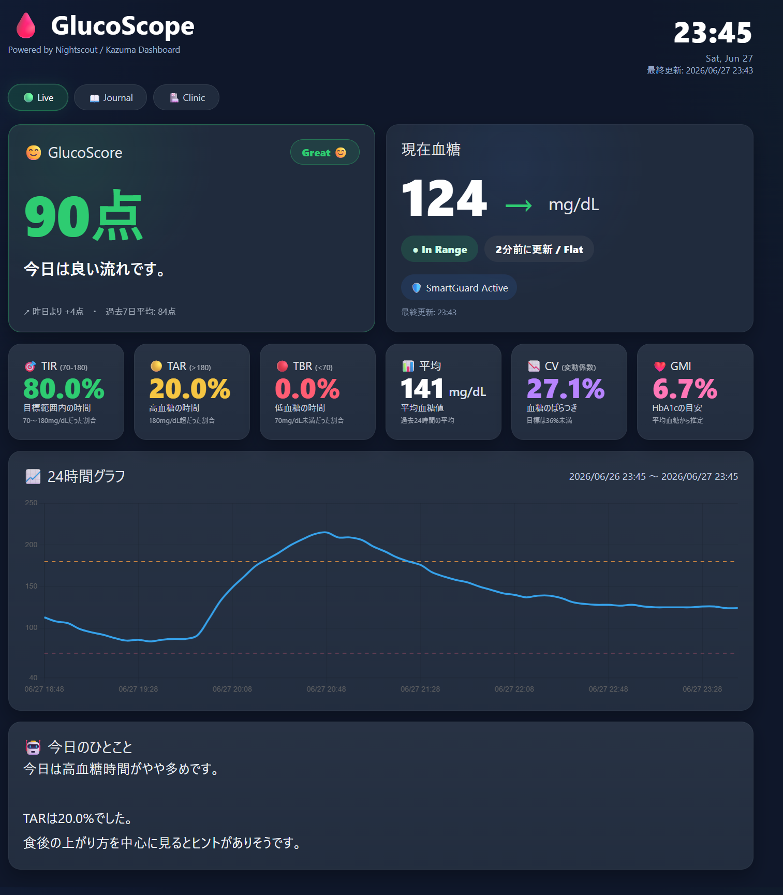

# 🩸 GlucoScope

> **Understand today. Improve tomorrow.**

GlucoScope は、Nightscout を利用する糖尿病患者のためのオープンソースダッシュボードです。

単に血糖値を表示するだけではなく、

- 今日を振り返る
- パターンを理解する
- 明日の管理を少し良くする

ことを目的としています。

将来的には AI を活用し、毎日の血糖管理をサポートするパートナーを目指します。

---

# ✨ 主な機能

## 📊 Live Dashboard

- リアルタイム血糖表示
- 24時間血糖グラフ
- TIR / TAR / TBR
- 平均血糖
- CV（血糖変動）
- GMI
- 今日のスコア（開発予定）

---

## 🤖 AIサポート（開発予定）

- 今日の血糖振り返り
- AIコメント
- 血糖パターン分析
- 昨日・先週との比較
- 週間・月間レポート

---

## ✍ 発信支援（開発予定）

ワンクリックで

- note記事
- Instagram投稿画像
- Threads投稿
- X投稿

を作成できます。

---

## 🏥 通院サポート（開発予定）

- 通院用PDF
- 90日統計
- TIR推移
- HbA1c推定
- AIによるサマリー

---

# 🌍 対応データ

Nightscout API に対応したデータであれば利用できます。

現在の主な対応環境

- MiniMed 780G
- Guardian Monitor
- Nightscout

将来的には

- Libre 2 / Libre 3
- Dexcom G7
- その他 Nightscout対応CGM

にも対応予定です。

---

# 🎯 プロジェクトの想い

糖尿病管理は、
数字を見ることだけではありません。

今日を理解し、

少しずつ学び、

明日をもっと良くする。

それが GulucoScope の考え方です。

複雑なデータを並べるのではなく、

**毎日自然と開きたくなるダッシュボード**

を目指しています。

---

# 🚀 ロードマップ

## v0.2 Foundation

- ダッシュボード全面リニューアル
- 今日のスコア
- グラフ改善
- レスポンシブ対応

---

## v0.3 Insights

- AIによる血糖分析
- 週間・月間分析
- AIコーチ

---

## v0.4 Creator

- note記事生成
- Instagram画像生成
- Threads / X投稿

---

## v1.0

AIを活用した糖尿病ライフサポートツール

---

# ❤️ オープンソース

このプロジェクトはオープンソースです。

アイデア・要望・改善提案・Pull Request を歓迎します。

一緒に、糖尿病患者が毎日使いたくなるツールを育てていけたら嬉しいです。

---

## Screenshot

Made with ❤️ by afterglow21

Powered by Nightscout

Built by a person living with Type 1 Diabetes.